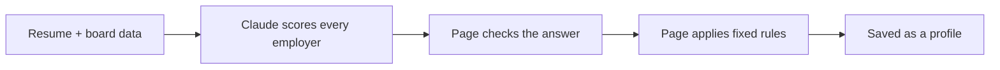

# How Job Finder Decides

This page explains the rules behind the board in plain language. There are two
parts:

- **The page** (`index.html`) shows the board and tailors it to a resume.
- **The refresh script** (`refresh.py`) checks job boards and reports what changed.

Claude is used for one job only: judging how well a person fits each employer.
Everything else (caps, tiers, badges, closing dates, sorting) is a fixed rule in
the code, so the same inputs always give the same board.

## 1. The board

Each employer card has four things:

| Field | What it is | Who sets it |
| --- | --- | --- |
| Score | 60 to 100, how well the candidate fits | Hand-set on the default board; Claude after a tailoring run |
| Tier | Tier 1 = top picks | Hand-set on the default board; the 8 highest scores after a tailoring run |
| Status | Whether you can apply now (below) | Hand-researched, then adjusted by the rules in this page |
| Openings | Specific job links, checked live on the date in the footer | Hand-researched, checked by `refresh.py` |

**Statuses**

| Status | Meaning |
| --- | --- |
| 🟢 Live role now | A matching opening is posted |
| 🟣 Suggested by Claude | Employer Claude added for this person (not verified) |
| 🟡 Opens later this fall | Expected to post soon |
| 🔵 Watch list | Nothing entry-level posted today |
| 🔴 Wrong cohort | Hiring, but the timing does not fit this graduate |

**Sorting:** cards are grouped by status in the order above, then sorted by
score, highest first.

**Filters:** a filter chip that would match nothing is hidden, so you never land
on an empty board.

## 2. Rules the page applies on every load

These run in your browser using today's date, so a board that has not been
refreshed for a while still tells the truth about deadlines.

- **Closed openings.** An opening past its closing date is struck through and
  stops counting toward anything.
- **Dropping to the watch list.** When every entry-level opening an employer
  lists has closed, the employer moves from Live role now to Watch list.
- **Closing soon.** The "closes" tag turns red when the deadline is 7 days or
  less away.

**Tags on each opening**

| Tag | Shown when |
| --- | --- |
| new-grad program | The title names a program ("new grad", "rotational", "2027", "analyst program"...) and does not say intern, senior, manager or director |
| relocate | The opening is not in Utah and not remote |
| N+ yrs | The posting asks for 2 or more years of experience |
| closes Sep 25 | The posting gives a closing date |
| applied | It matches something in My applications |
| leans SWE | The title is a software-engineering ladder (see below) |
| wants a CS degree | The posting's own degree bar, read from the listing |

**Weak fits**

This board is aimed at an information-systems resume, so two kinds of opening
are marked as a stretch rather than hidden:

- **Software-engineering ladders.** Titles such as Software Engineer, SDE,
  backend, front-end, full-stack, SRE, DevOps, embedded, mobile, and machine
  learning or AI engineer. The competition there is computer-science graduates.
  Data engineering is deliberately not on that list: SQL and Python work is this
  candidate's own ground.
- **Degree bars.** When the posting itself names only technical majors
  (computer science, EECS, statistics and the like) with no information-systems
  or business route in, or requires a master's or PhD. `refresh.py` reads this
  from the posting text; on the board it is recorded per opening by hand.

The **Hide weak fits** chip hides both. **Hide applied** hides openings you have
already applied to. Each card says how many of its openings a filter is hiding.

## 3. Tailoring to a resume

**Step 1: What gets sent.** The resume, plus every employer's facts: location,
industry, status, timing note, and its still-open openings with the years each
one asks for.

**Step 2: What Claude returns.** For each employer, only:

- a score from 60 to 100
- whether the employer's tools overlap the resume (yes or no)
- a status (normally "keep", meaning leave it as is)
- a location type relative to the candidate
- a short "why" and, if needed, a rewritten timing note

It also returns a profile header and, when needed, suggested employers.

Claude is told what the scores mean:

| Score | Meaning |
| --- | --- |
| 95 to 100 | Bullseye: field, location, skills and hiring pipeline all line up |
| 85 to 94 | Strong |
| 75 to 84 | Solid |
| 65 to 74 | Stretch |
| 60 to 64 | Weak |

**Step 3: The page checks the answer.** Claude's reply is treated as untrusted.

- Employer names must match the board; unknown names and duplicates are dropped.
- Scores are forced into the 60 to 100 range.
- If fewer than 80% of the employers come back, the whole run is rejected.

**Step 4: The page applies fixed rules.**

*Seniority cap.* The page compares the candidate's years of full-time experience
with the easiest open opening at each employer. Internships do not count as
experience, so a graduating student usually has 0.

| Easiest opening asks for | Highest possible score | Status |
| --- | --- | --- |
| At most 1 year more than the candidate has | No cap | Unchanged |
| 2 years more | 80 | Live role now becomes Watch list |
| 3 or more years more | 70 | Live role now becomes Watch list |

An opening that states no requirement counts as 0 years, so one real new-grad
role keeps an employer uncapped.

This rule lives in code because Claude was inconsistent about it in testing.

*Tiers.* The 8 highest scores become Tier 1. Everything else is Tier 2.

*Badges.* Built from facts, not asked of Claude:

- a location badge if the employer is local or has an office nearby
- Fintech and AI-Native, copied from the researched board
- Your Tools, if Claude said the tools overlap

**Step 5: Saved.** The result is stored as a profile in your browser. The resume
itself is never stored.

### Where the candidate lives

| Candidate | What happens |
| --- | --- |
| Lives in the Salt Lake area, or is moving there | Board keeps its Salt Lake locations. No location changes. |
| Lives somewhere else | Claude re-labels every employer as local, nearby office, remote or needs relocation, relative to the candidate's city. The Where filters are renamed to match, and the relocate tags are hidden. |
| Remote only, no city | Every employer becomes either remote or needs relocation. |

### Suggested employers

The board is built for data, AI, software and product roles around Salt Lake
City. When that does not fit the person, Claude adds up to 15 employers in their
own city and field.

- **Added when:** the candidate lives outside the Salt Lake area, **or** their
  resume does not fit those role types (a nurse, a teacher, a chemist).
- **Not added when:** the candidate is in Salt Lake **and** fits those roles.
  The researched board is already right for them.
- They are marked **not verified**, and their button searches the web for the
  careers page instead of linking to a job.
- **When they go first:** if the best suggested score beats the best board score
  by 8 or more points, the suggested group moves to the top of the page.

### University of Utah extras

The career fair strip and the "Hires from the U" filter only appear when the
resume shows a University of Utah student. For those students, employers with a
known U of U hiring pipeline get +3 points (strong pipeline) or +1 (some).

## 4. Old profiles after the board is updated

A saved profile remembers the board date and each employer's facts (its status
and the opening links) at the time it was made. If the board has been
re-verified since, or an employer's facts have changed:

- **The board's current status wins.** Only Claude's "Wrong cohort" verdict is
  kept, because that is about the person's graduation date, not about what is
  posted.
- **The seniority cap is re-run** against today's openings, starting from
  Claude's original score. A cap can loosen as well as tighten.
- **An employer with no openings** cannot be a live role.
- **Employers added after the profile was made** are hidden until you tailor
  again.
- The footer warns that the profile's Apply now and Watch later advice is older
  than the board.

## 5. Matching your applications to the board

**Company names** (the page and `refresh.py` use the same rules, so they agree)

- Endings like Inc, LLC, LLP, Corp, Bank and Group are ignored: "KPMG LLP" is KPMG.
- Known other names count: Amex, Citibank, Ernst & Young, J.P. Morgan.
- Extra words that are not endings mean a different company: "Capital One" is
  not iCapital, and "Pattern Energy" is not Pattern.

**Importing a spreadsheet**

The tracker reads the file people actually keep: `.xlsx`, CSV, TSV, or rows
pasted straight out of Excel.

- Columns are matched by header name in any order. **Company** and **Job** (or
  Title) are required; **Date**, **Location** and **Result** are used if present.
- A **Result** such as "Denied, experience" sets the status to rejected and is
  kept as the note. "HireVue" or "interview" means interview, "offer" means
  offer, blank means pending.
- Dates can be `2026-09-13`, `9/13/2026`, `13-Sep` or an Excel date. A date with
  no year means the most recent one that has already passed.
- A row whose date says something like "not yet" is a shortlist entry, not an
  application, so it is skipped and counted in the message.
- Importing the same sheet twice changes nothing, so re-import after each edit.

**Job titles on the page**

- Two titles match when at least 80% of their combined words are shared. Years,
  "the", "of" and "and" are ignored.
- If an employer posts the same title in two cities, the city you recorded
  decides which one you applied to.

**Job titles in `refresh.py`** (a little looser)

- At least 80% of the words in the title you applied to must appear in the
  posting. The posting may add words, like a city or program name.
- The added words cannot include a seniority word, so "Security Analyst II" is
  not the "Security Analyst" job you applied to.

## 6. The refresh script

`python3 refresh.py` runs these steps:

1. Reads about 100 employer job boards, 8 at a time.
2. Keeps only job titles that pass the title rules below.
3. Compares with the last run (saved in `.refresh-state.json`) to find new and
   closed roles.
4. Tests every job link already on the board.
5. Flags weak fits: `[SWE]` for a software-engineering ladder, and
   `[technical majors]` or `[MS/PhD]` where the posting's own degree line says so.
6. Writes everything to `refresh-report.txt`.

It reads your applications from `applications.json`, or straight from your
spreadsheet if you name it `applications.csv`, `applications.tsv` or
`applications.xlsx` and leave it beside the script. All four names are
git-ignored.

### Title rules

Each title goes through these checks in order. The first one it fails removes it.

| # | Check | Examples removed |
| --- | --- | --- |
| 1 | Seniority words | Senior, Lead, Manager, Director, II, III, Intermediate |
| 2 | Numbered level 2 to 5 (unless the title also says new grad) | Programmer Analyst 2 |
| 3 | "Staff", except in audit, accounting or consulting, where it is the first level | Staff Engineer |
| 4 | Wrong cohort | Intern, Co-op, Summer Analyst, MBA, Master's, PhD, Fellowship |
| 5 | Off-topic work | Sales, Marketing, Recruiting, Nurse, Teller, Part-time |
| 6 | Every location outside the US | London only |

"Associate Product Manager" and "APM" are allowed through check 1, because that
is an entry-level job despite the word "manager".

A title that passes all six is kept if:

| Kept as | When |
| --- | --- |
| program | The title names a new-grad program |
| entry | The title uses entry-level wording (Analyst, Associate, Junior, "I") |
| ?years | It is in Utah and on-topic, but has no level word. Read the posting to check. |

Anything else is dropped. Titles with no level word are kept only in Utah,
where there are few enough to read one by one.

**Location.** A job listed in several cities is judged by its best one:
Utah first, then remote, then elsewhere.

### How the report is grouped

1. New roles in Utah
2. New remote roles
3. New-grad programs elsewhere (worth relocating for)
4. Other entry-level roles elsewhere
5. Every live role closing in the next 14 days
6. Roles closed since the last run
7. Dead links on the board
8. Openings on the board past their closing date
9. Your applications, and whether the script could have found each one
10. Employers to check by hand (Deloitte, EY, KPMG)
11. Boards that failed or were read only in part

### Safety rules

These stop the report from crying wolf.

- **A board that suddenly returns zero jobs** (after having 3 or more last time)
  is treated as a failed read, not as every job closing at once.
- **A board that fails** keeps last run's list, so the next good run compares
  against real data.
- **Changing the title rules** starts a fresh baseline: everything is listed as
  new rather than falsely reported as closed.
- **A link is only called dead** when there is a definite sign the job is gone:
  the hiring system's own API says it no longer exists, or the job page says it
  was closed or not found. Anything unclear, such as a blocked request or a
  CAPTCHA, counts as unknown and is never reported.
