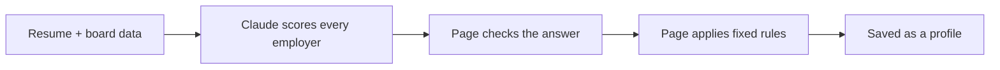

# How Job Finder Decides

This page explains the rules behind the board in plain language. There are two
parts:

- **The page** (`index.html`) shows the board and the list of all openings,
  tailors them to a resume, and can search the web for more.
- **The refresh script** (`refresh.py`) reads employers' job feeds, builds the
  openings database the page loads (`jobs.json`), and reports what changed.

Claude is used for three jobs: judging how well a person fits each employer,
ranking the openings in the database for that person, and searching the web for
openings the database does not have. Everything else (caps, tiers, badges,
closing dates, sorting, which titles count as entry-level) is a fixed rule in
the code, so the same inputs always give the same board. Nothing Claude returns
is used unchecked: sections 3 and 8 say how each answer is checked.

Sections 1 to 5 cover the board. Section 6 covers the refresh script and the
database it builds, section 7 the All openings list that shows that database,
and section 8 Search deeper.

## 1. The board

Two tabs sit above the filters: **Employers**, which is this board, and **All
openings**, which lists one row per job (section 7).

Each employer card has four things:

| Field | What it is | Who sets it |
| --- | --- | --- |
| Score | 60 to 100, how well the candidate fits | Hand-set on the default board; Claude after a tailoring run |
| Tier | Tier 1 = top picks | Hand-set on the default board; the 8 highest scores after a tailoring run |
| Status | Whether you can apply now (below) | Hand-researched, then adjusted by the rules in this page |
| Openings | Specific job links, checked live on the date in the footer | Hand-researched, checked by `refresh.py` |

**Statuses**

| Status | Meaning |
| --- | --- |
| 🟢 Live role now | A matching opening is posted |
| 🟣 Suggested by Claude | Employer Claude added for this person (not verified) |
| 🟡 Opens later this fall | Expected to post soon |
| 🔵 Watch list | Nothing entry-level posted today |
| 🔴 Wrong cohort | Hiring, but the timing does not fit this graduate |

**Sorting:** cards are grouped by status in the order above, then sorted by
score, highest first.

**Filters:** a Timing, Where or Industry chip that would match nothing is
hidden; Role, Tier and the other chips stay, so a search or an odd combination
can still show "No matches".

**New this week:** the first chip in the Timing row. It shows only employers
with an opening added in the six days up to the latest refresh (or added to the
board in that time), and on each card only the new openings. The number on the
chip counts those new openings and employers.

**More openings on a card:** a card ends with a button such as "+ 12 more
openings on their job feed · 3 new" when the employer's own feed lists
entry-level openings beyond the ones on the card. Those were read by
`refresh.py`, not by hand. The button opens the All openings list on that
employer alone.

## 2. Rules the page applies on every load

These run in your browser. The deadline rules use today's date, so a board that
has not been refreshed for a while still tells the truth about deadlines.

- **Closed openings.** An opening past its closing date is struck through and
  stops counting toward anything.
- **Dead links.** When `jobs.json` loads, any link on the board that the
  employer's own hiring system no longer recognised at the last refresh is struck
  through and tagged "no longer posted". From then on it is treated as closed: it
  is not counted as new, not sent to Claude and not listed in All openings. This
  used to wait for a hand edit.
- **Dropping to the watch list.** When every entry-level opening an employer
  lists has passed its closing date, the employer moves from Live role now to
  Watch list. This rule reads closing dates only, so a dead link does not move
  the card by itself: the card's status waits for the next hand edit.
- **Closing soon.** The "closes" tag turns red when the deadline is 7 days or
  less away.

**Tags on each opening**

| Tag | Shown when |
| --- | --- |
| new | It was added to the board in the six days up to the latest refresh (its `added` date is `REFRESH_DATE` or up to six days before it), and it has not passed its closing date or lost its link. A mid-week refresh therefore keeps the tags the last one set, and a refresh a week later clears them. A repost of a program already listed, or a role the board had overlooked, is not tagged |
| no longer posted | The employer's hiring system no longer recognised the link at the last refresh (see Dead links above) |
| new-grad program | The title names a program ("new grad", "rotational", "2027", "analyst program"...) and does not say intern, senior, manager or director |
| relocate | The opening is not in Utah and not remote |
| N+ yrs | The posting asks for 2 or more years of experience |
| closes Sep 25 | The posting gives a closing date |
| applied | It matches something in My applications |
| leans SWE | The title is a software-engineering ladder (see below) |
| wants a CS degree | The posting's own degree bar, read from the listing |

**Weak fits**

This board is aimed at an information-systems resume, so two kinds of opening
are marked as a stretch rather than hidden:

- **Software-engineering ladders.** Titles such as Software Engineer, SDE,
  backend, front-end, full-stack, SRE, DevOps, embedded, mobile, and machine
  learning or AI engineer. The competition there is computer-science graduates.
  Data engineering is deliberately not on that list: SQL and Python work is this
  candidate's own ground.
- **Degree bars.** When the posting itself names only technical majors
  (computer science, EECS, statistics and the like) with no information-systems
  or business route in, or requires a master's or PhD. `refresh.py` reads this
  from the posting text; on the board it is recorded per opening by hand.

The **Hide weak fits** chip hides both. **Hide applied** hides openings you have
already applied to. Each card says how many of its openings a filter is hiding.

## 3. Tailoring to a resume



**Step 1: What gets sent.** The resume, plus every employer's facts: location,
industry, status, timing note, and its still-open openings with the years each
one asks for.

**Step 2: What Claude returns.** For each employer, only:

- a score from 60 to 100
- whether the employer's tools overlap the resume (yes or no)
- a status (normally "keep", meaning leave it as is)
- a location type relative to the candidate
- a short "why" and, if needed, a rewritten timing note

It also returns a profile header and, when needed, suggested employers.

Claude is told what the scores mean:

| Score | Meaning |
| --- | --- |
| 95 to 100 | Bullseye: field, location, skills and hiring pipeline all line up |
| 85 to 94 | Strong |
| 75 to 84 | Solid |
| 65 to 74 | Stretch |
| 60 to 64 | Weak |

**Step 3: The page checks the answer.** Claude's reply is treated as untrusted.

- Employer names must match the board (exactly, or ignoring case, punctuation
  and a parenthetical); unknown names and duplicates are dropped.
- Scores are forced into the 60 to 100 range.
- If fewer than 80% of the employers come back, the whole run is rejected.

**Step 4: The page applies fixed rules.**

*Seniority cap.* The page compares the candidate's years of full-time experience
with the easiest open opening at each employer. Internships do not count as
experience, so a graduating student usually has 0.

| Easiest opening asks for | Highest possible score | Status |
| --- | --- | --- |
| At most 1 year more than the candidate has | No cap | Unchanged |
| 2 years more | 80 | Live role now becomes Watch list |
| 3 or more years more | 70 | Live role now becomes Watch list |

An opening that states no requirement counts as 0 years, so one real new-grad
role keeps an employer uncapped.

This rule lives in code because Claude was inconsistent about it in testing.

*Tiers.* The 8 highest scores become Tier 1. Everything else is Tier 2.

*Badges.* Built from facts, not asked of Claude:

- a location badge if the employer is local or has an office nearby
- Fintech and AI-Native, copied from the researched board
- Your Tools, if Claude said the tools overlap

**Step 5: Saved.** The result is stored as a profile in your browser. The resume
itself is never stored.

**After the tailoring.** The upload dialog has two more boxes under *How far to
look*, both ticked by default: rank every opening in the database, and search
the web. They are the two steps of Search deeper (section 8). Left ticked, they
run straight after the tailoring with the resume attached. Untick both to tailor
the board only.

### Where the candidate lives

| Candidate | What happens |
| --- | --- |
| Lives in the Salt Lake area, or is moving there | Board keeps its Salt Lake locations. No location changes. |
| Lives somewhere else | Claude re-labels every employer as local, nearby office, remote or needs relocation, relative to the candidate's city. The Where filters are renamed to match, and the relocate tags are hidden. |
| Remote only, no city | Every employer becomes either remote or needs relocation. |

These are instructions to Claude. The page decides local mode by one test: if
every employer's location type comes back unchanged, the board stays in Salt
Lake mode; if any changed, the Where filters are relabeled to the candidate's
metro.

### Suggested employers

The board is built for data, AI, software and product roles around Salt Lake
City. When that does not fit the person, Claude adds up to 15 employers in their
own city and field (the page accepts at most 20).

- **Added when:** the candidate lives outside the Salt Lake area, **or** their
  resume does not fit those role types (a nurse, a teacher, a chemist).
- **Not added when:** the candidate is in Salt Lake **and** fits those roles.
  The researched board is already right for them.
- They are marked **not verified**, and their button searches the web for the
  careers page instead of linking to a job.
- **When they go first:** if the best suggested score beats the best board score
  by 8 or more points, the suggested group moves to the top of the page.

### University of Utah extras

The career fair strip and the "Hires from the U" filter only appear when the
resume shows a University of Utah student. For those students, employers with a
known U of U hiring pipeline get +3 points (strong pipeline) or +1 (some) on the
displayed score and in the sort order; tiers are assigned from the score before
the bonus.

## 4. Old profiles after the board is updated

A saved profile remembers the board date and each employer's facts (its status
and the opening links) at the time it was made. If the board has been
re-verified since, or an employer's facts have changed:

- **The board's current status wins.** Only Claude's "Wrong cohort" verdict is
  kept, because that is about the person's graduation date, not about what is
  posted.
- **The seniority cap is re-run** against today's openings, starting from
  Claude's original score. A cap can loosen as well as tighten. (A profile saved
  before the page recorded years of experience keeps its frozen scores.)
- **An employer with no openings** cannot be a live role once the board is
  newer than the profile.
- **Employers added after the profile was made** are hidden until you tailor
  again.
- The footer warns that the profile's Apply now and Watch later advice is older
  than the board.

## 5. Matching your applications to the board

**Company names** (the page and `refresh.py` use the same rules, so they agree)

- Endings like Inc, LLC, LLP, Corp, Bank and Group are ignored: "KPMG LLP" is KPMG.
- Known other names count: Amex, Citibank, Ernst & Young, J.P. Morgan.
- Extra words that are not endings mean a different company: "Capital One" is
  not iCapital, and "Pattern Energy" is not Pattern.

**Importing a spreadsheet**

The tracker reads the file people actually keep: `.xlsx`, CSV, TSV, or rows
pasted straight out of Excel.

- Columns are matched by header name in any order. **Company** and **Job** (or
  Title) are required; **Date**, **Location** and **Result** are used if present.
- A **Result** such as "Denied, experience" sets the status to rejected and is
  kept as the note. "HireVue" or "interview" means interview, "offer" means
  offer, blank means pending.
- Dates can be `2026-09-13`, `9/13/2026`, `13-Sep` or an Excel date. A date with
  no year means the most recent one that has already passed.
- A row whose date says something like "not yet" is a shortlist entry, not an
  application, so it is skipped and counted in the message.
- Importing the same sheet twice changes nothing, so re-import after each edit.

**Job titles on the page**

- Two titles match when at least 80% of their combined words are shared. Years,
  "the", "of" and "and" are ignored.
- If an employer posts the same title in two cities, the city you recorded
  decides which one you applied to.
- If an employer posts the same title for two graduating classes (Verkada's
  University Graduate 2026 and 2027), the year in the title you recorded decides.

**Job titles in `refresh.py`** (a little looser)

- At least 80% of the words in the title you applied to must appear in the
  posting. The posting may add words, like a city or program name.
- The added words cannot include a seniority word, so "Security Analyst II" is
  not the "Security Analyst" job you applied to.

## 6. The refresh script

`python3 refresh.py` runs these steps:

1. Lists its sources: more than 300 job feeds, from the three lists below.
2. Asks each site's robots.txt whether the feed may be read, then reads the
   feeds, 8 at a time.
3. Puts every title through the title rules below.
4. Tests every job link already on the board.
5. Compares with the last run (saved in `.refresh-state.json`) to find new and
   closed roles for the report.
6. Records every row in the job database (`jobs.db`) and writes the published
   slice of it (`jobs.json`), which the page loads.
7. Flags weak fits: `[SWE]` for a software-engineering ladder, and
   `[technical majors]` or `[MS/PhD]` where the posting's own degree line says so.
8. Writes the report to `refresh-report.txt`.

A full run takes several minutes. Four options change what a run does:

| Command | What it does |
| --- | --- |
| `python3 refresh.py --skip utahjobs` | Leaves one kind of feed out of the run. The state job bank is the slowest, about four minutes on its own. Several kinds can be listed with commas |
| `python3 refresh.py --only utahjobs` | Reads only that kind of feed |
| `python3 refresh.py --why "business intelligence analyst"` | Reads no feeds. Says what the database already knows about matching jobs (see The job database below) |
| `python3 refresh.py --selftest` | Reads no feeds. Runs the title, years and matching rules against fixed examples, offline |

What the database holds for a feed left out of a run is not touched.

**What updates by itself, and what is still a hand edit.** The page loads
`jobs.json`, so the All openings list, the "more openings" button on each card
and the struck-out dead links are current as soon as the page is reloaded. The
cards themselves are not written by the script. Putting a new opening on a card
is a hand edit to `index.html`: add it with `added` set to the new refresh date
and set `REFRESH_DATE` and the footer date to that date. It then shows as
**new** on the board until `REFRESH_DATE` is more than six days past its `added`
date.

It reads your applications from `applications.json`, or straight from your
spreadsheet if you name it `applications.csv`, `applications.tsv` or
`applications.xlsx` and leave it beside the script. All four names are
git-ignored.

### Asking first: robots.txt

Before it reads anything on a site, the script fetches that site's robots.txt,
once a run, and does what it says. A public job feed is an invitation to read
it, and a robots.txt rule is the site saying no, so the script takes the site at
its word.

- A path closed to all crawlers is not read. The source is listed in the report
  as not read, with the reason.
- Where rules overlap, the longest matching rule wins and Allow wins a tie.
- A stated crawl delay is kept, up to 15 seconds between requests to that site.
- If the robots.txt itself cannot be fetched because the site is down, nothing
  on that site is read in that run. A site with no robots.txt closes nothing.

What follows from it:

- The University of Utah is read through the search service its own careers
  pages call, 15 jobs a request, and not through its bulk feed, which would take
  three requests. The site's robots.txt asks scripts not to fetch the bulk feed.
- Employers on NEOGOV (governmentjobs.com and schooljobs.com), PeopleAdmin, UKG,
  Paycom and Paycor are not read at all.
- There is one exemption list, `DOCUMENTED_APIS`, for an API that its vendor
  documents as public while the robots.txt on the API's host turns every crawler
  away. It ships empty. SmartRecruiters is the documented case, and a finished
  reader for it is parked as `readers/_smartrecruiters.py`. Using it means adding
  the host to that list and dropping the underscore, which is your decision.

### The three source lists

| List | Who is in it | What you get |
| --- | --- | --- |
| `BOARDS` | About 100 feeds. Most belong to the employers that have a hand-written card, a few of which need two. About twenty are security companies that have no card on the board today | A card where there is one, plus every entry-level role on their feed in All openings |
| `MORE` | About 180 employers read for the database only | No card. Every entry-level role they post is in All openings |
| `readers/` | One small file per further hiring system, each naming its own employers | The same as `MORE` |

A reader file is picked up by itself on the next run. It names its kind
(`KIND`), its employers (`EMPLOYERS`) and a `fetch(slug)` function. It may also
say whether one of its links is still live (`link_state`), mark its employers as
institutions, give a place to assume for a single-city employer, or declare
itself a relisting source (`AGGREGATOR`, below). A file whose name starts with an
underscore is parked: it is not loaded.

**Employers the script cannot read are not forgotten.** `MANUAL` lists about 40
of them with their careers pages, and `MANUAL_WHY` records the reason: the hiring
system's robots.txt says no, the careers site answers a script with a bot check,
or there is no feed of any kind. One of them (Datafy) has a card on the board.
Deloitte, EY and KPMG used to be on this list and are now read directly. The
report lists them all to check by hand.
`jobs.json` publishes them as `unread`, which is the first list Search deeper
works through (section 8).

To add an employer, find which hiring system its careers page uses and add it to
`MORE` with the slug that kind expects. `--why` tells you when that is needed: a
job no feed has ever returned is at an employer that is not a source.

### Relisting sources: the state job bank

`readers/utahjobs.py` reads Utah's Department of Workforce Services job bank
(jobs.utah.gov) with about fifteen keyword searches within 50 miles of Salt Lake
City. It lists jobs at hundreds of employers, including many whose own careers
sites the script cannot read.

Its rows are leads, not postings:

- The link opens the job bank, which asks for a free UtahID sign-in before it
  shows the posting.
- A title longer than 40 characters arrives cut short. It is marked with an
  ellipsis.
- It carries no posting text, so no years of experience or degree bar are read.

So two rules apply to a relisting source, which is any reader that sets
`AGGREGATOR` (the state job bank and the federal job site, USAJOBS):

- **It never owns a job.** When an employer's own feed and a relisting source
  both carry a job, the employer's row is the one kept.
- **It is published only for employers the script does not read itself.** Where
  an employer's own feed was read, that feed is the truth about its jobs. The
  relisted copies are the same jobs under a second link, or ones the employer
  has already taken down.

A published lead is flagged in `jobs.json`. The page tags it "state job bank
lead" and puts a "find the employer's posting" search link beside it. The page
has that one tag for every relisted row, so a USAJOBS row carries it too,
although its link opens the federal announcement itself.

### Title rules

A feed row is judged by its title and its location. Three adjustments are made
before the checks:

- **The entry rung of product management** (`ENTRY_MANAGER`). "Associate Product
  Manager" is read as an associate, because that is an entry-level job despite
  the word "manager". The same goes for a junior one, and for program and
  project managers.
- **Data managers** (`DATA_MANAGER`). In clinical research a data manager manages
  data, not people, so "Clinical Data Managers" is not stopped by the word
  "Managers". A plain "Data Manager" still is.
- **Institutions** (`INSTITUTIONS`). At a university, a government or a hospital
  the words "University", "Campus", "Graduate" and "Academic" are plain
  description, where on a company's feed they mean a new-grad program. For the
  employers named in that list they are taken out first. "Campus Events
  Assistant" at the University of Utah is not a program; the same title on a
  company's feed would be kept as one.

Each title then goes through these checks in order. The first one it fails
removes it.

| # | Check | Examples removed |
| --- | --- | --- |
| 1 | Seniority words (`SENIOR`): Senior, Sr, Principal, Lead, Manager, Director, Head, VP, Chief, Architect, Supervisor, Counsel, Executive, II, III, IV, Intermediate. Plurals count too, because public employers title a requisition by its job family | "Senior Network Engineer", "Information Systems Architects", "Software Engineer III" |
| 2 | Numbered level 2 to 5 after a job word such as analyst or engineer, unless the title also says new grad. A duration or a date is not a level | "Business Intelligence Analyst 2". Not removed: "Software Engineer 2 - New College Grad", "Technology Analyst 2-Year Rotational Program" |
| 3 | "Staff", except in audit, accounting or consulting, where it is the first level | "Staff Enterprise Security Engineer". Not removed: "Staff Auditor" |
| 4 | Wrong cohort (`WRONG_COHORT`): Intern, Co-op, Summer Analyst, Seasonal, Apprentice, MBA, Master's, PhD, Postdoc, Fellowship, Return to Work. Also academic ranks and student jobs: Professor, Lecturer, Adjunct, Dean, Graduate Assistant, Work-Study, Residency | "Product Management Intern, Summer 2027 - Singapore", "Research Assistant Professor", "Office Assistant - Work Study" |
| 5 | Off-topic work (`OFFTOPIC`): sales, marketing, recruiting, legal, tax and payroll; clinical and patient-facing jobs; trades, facilities and food service; hourly plant and shift work; temporary and recreation jobs; tellers, part-time and hourly roles. Also a technician, unless the title names a lab, research, IT, data or engineering setting, and an operator, unless it names computers, networks, data or security | "Sales Development Representative - German Speaking (Hybrid, ESP)", "Kidney Transplant RN Coordinator", "Inspector / Packer", "Lodging Maintenance Technician - Winter 2026 - 27", "Paleontology Digitization Technician" |
| 6 | Every location outside the US | London only |

Two details of checks 4 and 5. A season with a year is not a wrong cohort: "New
Grad (Spring 2027 Start)" is a full-time start date. And "clinical" is off-topic
only for clinicians: "Clinical Data Managers" and "Clinical Informatics Analyst"
are data jobs and pass.

A title that passes all six is kept if:

| Kept as | When | Examples |
| --- | --- | --- |
| program | The title names a new-grad program (`PROGRAM`): new grad, graduate, early career, university, campus, rotational, class of, talent pipeline, 2026 or 2027, or a named kind of program such as a development, leadership, analyst, rotation or trainee program. A bare "program" is not enough | "2027 Software Engineer Program - Full-Time - United States - February Start", "June 2027 Associate Credit Analyst, Banker Development Program - Irvine". Not a program: "Program Mentor - School of Health" |
| entry | The title uses entry-level wording (`ENTRYWORD`): entry level, Junior, Associate, Analyst, level I, a job word followed by I or 1, or a title that ends in I. Plurals count ("Analysts", "Associates"). A "Staff" title in audit or accounting counts too | "Business Intelligence Analysts", "Revenue Operations Analyst", "Program Assistant I" |
| ?years | It is in Utah and on-topic (`ONTOPIC`: data, analytics, AI, software, developer, engineer, product, risk, fraud, compliance, audit, security, operations, technology, implementation, systems, automation, quality, reporting and the like), but has no level word. Read the posting to check | "Information Systems Engineer", "Clinical Data Managers" |

Anything else is dropped. Titles with no level word are kept only in Utah,
where there are few enough to read one by one: "Production Engineer" in Bellevue
is dropped, and so is "Housing Ambassador" in Salt Lake City, which has no
on-topic word.

The report writes the third class as `?years`, the database calls it
`unleveled`, and the page tags it "level not stated".

The examples are titles the feeds carried when this was written. These are word
tests on a title, so they make mistakes in both directions. `--why` shows which
rule decided any one job.

**Location.** A job listed in several cities is judged by its best one:
Utah first, then remote, then elsewhere. An employer that works in one place and
whose feed names buildings instead of cities ("City Hall") has its place added
from `ASSUMED_PLACE`.

### Experienced and internal-only postings

Two classes of posting are real but are not entry-level openings. They are
published in `jobs.json` in a class of their own, and the page leaves them out of
the list unless asked (section 7).

**Experienced** (`experienced()`). A title removed only for its level, by check
1, 2 or 3, is published as the level `senior` when all of these hold:

- it is in Utah
- it is not management: no Manager, Director, Head, VP, Chief, Supervisor,
  Counsel, Executive, Officer or President in the title
- it is not off-topic and not a wrong cohort
- it has an on-topic or entry-level word

Published this way: "Senior Network Engineer", "Solutions Architect", "Data Cloud
Architect", "Clinical Data Managers II". Not published: "Senior Product Manager",
"Director of Facilities Management". The reason for publishing them is that
someone with a few years behind them uses the same page, and a new graduate can
ask to see what the next rung looks like. They never appear in the report as
entry-level roles.

**Internal only.** A posting that its feed marks as open to current employees
only is published with a flag and is not listed as an ordinary opening. The
University of Utah says so in each posting's "Type of Recruitment" field: "Data /
Reporting Analysts" was one. The title rules still apply to it.

### Years of experience

The years a posting asks for are read from the posting text wherever a feed
supplies it. The state job bank supplies none, and none is read from a USAJOBS
announcement, which states experience grade by grade. The page treats two or
more years as out of reach for a new graduate, so a wrong number hides a real
job, and the reading is careful for that reason:

- The text is cut into sentences and list items, so one bullet is never read
  together with the next.
- A "Preferred" or "Nice to have" section is skipped whole.
- A soft word ("ideally", "a plus") softens a number only in its own clause:
  "2+ years in a customer-facing role, ideally in SaaS" is a firm two.
- An upper bound ("up to 2 years") is no bar and reads as 0.
- An exchange rate ("one year of experience for one year of education") is not a
  requirement.
- Somebody else's experience ("leaders with 20+ years") is ignored.
- The first requirement after the requirements heading wins, because a posting
  lists its main bar first. A range takes its low end: "3-5 years" is 3.
- "No experience required" reads as 0. Nothing stated is unknown, never 0.

The University of Utah's postings carry a fixed Minimum Qualifications block, so
the number is read from that block, and the lowest is used where it lists
several.

This is a reading aid, not a verified fact. A number read this way is shown with
a tilde ("~3+ yrs") in All openings. A number on a board card was read by hand
and has no tilde.

### Fields

Every row gets one of ten fields from its title, for the Field filter. The rules
are tried in this order and the first match wins, so the order is the rule: a
"Data Privacy Analyst" is risk, not data.

| Order | Field | Page label | Example |
| --- | --- | --- | --- |
| 1 | security | Security | "Research Security Analyst" |
| 2 | risk | Risk, audit & compliance | "Data Privacy Analyst", "Staff Auditor" |
| 3 | data | Data & analytics | "Financial Data Analyst", "Business Intelligence Analysts" |
| 4 | engineering | Engineering | "Civil Engineer", "Process Engineer" |
| 5 | research | Research & lab | "Research Scientist" |
| 6 | software | Software & IT | "Software Engineer", "Information Systems Architects" |
| 7 | finance | Finance | "Treasury Analyst", "Credit Analyst" |
| 8 | product | Product & projects | "Associate Product Manager", "Implementation Specialist" |
| 9 | business | Business & operations | "Revenue Operations Analyst" |
| 10 | other | Other | "Campus Events Assistant" |

One more rule runs just before "other": a technician, technologist, chemist or
biologist that matched nothing above is filed under research.

### The job database

Every row every feed returns is recorded in `jobs.db` (SQLite, git-ignored),
whether the title rules kept it or not. For each row it holds what it was kept
as or which rule dropped it, the facts read from the posting, the day it was
first seen, the day it was last seen, and the day it left the feed.

| Word | What it means in the database |
| --- | --- |
| new | A row the title rules keep whose link appears for the first time, on a feed the script was already reading before today. The run that first reads a feed counts none of its rows as new: that run says when the script arrived, not when the jobs did, so those rows are published without a first-seen date |
| gone | A row that was live and is missing from today's reading of its feed. It is dated and leaves `jobs.json`. Its history stays in `jobs.db`, and it is live again if it comes back |
| moved | A row that vanishes on the day the same title and place appear under a new link on the same feed. That is one job with a new address, so the new link keeps the old first-seen date |

A feed that fails, or is left out with `--skip` or `--only`, is left exactly as
it was. None of its rows are marked gone.

`jobs.json` is the published slice (committed, about 1 MB). It holds every live
row the title rules keep, plus experienced-level roles in Utah and internal-only
postings. Rows past their closing date are left out, and so are relisted rows at
employers the script reads itself. Besides the jobs it carries the date of the
run and of the one before it, a few totals (feeds read, employers, entry-level
openings, experienced-level roles, internal-only postings and relisted leads),
the links on the board that failed today's check (`dead`) and the employers the
script cannot read (`unread`). Each job has its employer, title, place, link,
where it is (home, remote or elsewhere), its level (`program`, `entry`,
`unleveled` or `senior`) and its field. Where they are known it also has the
years asked for, the degree bar, the closing date, the posted date, the
first-seen date, the feed it came from where that is not the employer's name,
and flags for internal-only, relisted lead, software-engineering ladder and the
card it belongs to.

`python3 refresh.py --why "words"` looks the words up in every title, employer
and link in the database, live or gone, and says for each match (it prints the
first 60) one of:

- kept and published, and as what
- on the feed but dropped by the title rules, and by which rule
- published as an experienced-level role
- published, but open to internal applicants only
- no longer on the feed, and when it was last seen

If nothing matches, no feed has ever returned the job, which means its employer
is not a source.

### How the report is grouped

The report opens with two lines of totals. The first is for this run: boards
checked, entry-level roles live on them (in Utah, remote, and new-grad programs
elsewhere) and employers to check by hand. The second is for the database:
openings published, experienced-level roles, internal-only postings, employers,
relisted leads, and how many rows are new, gone and moved since the last run.
Then:

1. New roles in Utah
2. New remote roles
3. New-grad programs elsewhere (worth relocating for)
4. Other entry-level roles elsewhere
5. Every live role closing in the next 14 days
6. Roles closed since the last run
7. Sources read for the first time (their roles are in `jobs.json` but are not
   listed above as new)
8. Dead links on the board, marked "moved" where the same title is still posted
   under a new link
9. Openings on the board past their closing date
10. Your applications, and whether the script could have found each one
11. Employers to check by hand (the `MANUAL` list, each with its careers page and
    the reason it is not read)
12. Boards that failed, were closed by robots.txt, or were read only in part

### Safety rules

These stop the report from crying wolf.

- **A site's robots.txt is asked before anything on it is read**, link checks
  included. A path it closes is not read, and a link the script may not probe
  counts as unknown, never as dead.
- **A board that suddenly returns zero jobs** (after having 3 or more last time)
  is treated as a failed read, not as every job closing at once.
- **A board that fails** keeps last run's list, so the next good run compares
  against real data. Its rows in the database are left as they were.
- **Changing the title rules** starts a fresh baseline: everything is listed as
  new rather than falsely reported as closed.
- **A link is only called dead** when there is a definite sign the job is gone:
  the hiring system's own API says it no longer exists, or the job page says it
  was closed or not found. Anything unclear, such as a blocked request or a
  CAPTCHA, counts as unknown and is never reported.
- **A dead link whose title is still on the employer's feed is reported as
  moved**, with the new link, not as a closed role. Some careers sites hand every
  posting a new address when they re-index (Zions did in October 2026), and
  employers repost a program under a new requisition number.
- **A relisting source never takes over a job** that an employer's own feed
  lists, so a job bank copy cannot replace the real posting.

## 7. The All openings list

The board can only show what somebody thought to add. The **All openings** tab
is the other half: one row per job instead of one card per employer. It needs no
API key.

### Where the rows come from

The list is built from three places, and each job is listed once.

| From | What it adds | Which facts win |
| --- | --- | --- |
| `jobs.json` | Every live opening `refresh.py` published: entry-level roles, experienced-level roles, internal-only postings and relisted leads | The feed's own |
| The board | The openings hand-read onto the cards | Where the same job is in both, the hand-read years, degree bar, closing date and new-grad program flag replace the feed's |
| Web finds | What Search deeper saved for the profile on screen (section 8) | A find is left out when an employer's own feed already has the job. A state job bank lead for the same job gives way to the find, because the find links to the real posting |

Two rows are the same job when their links carry the same posting id, since one
posting is often linked in more than one form. A board opening is also matched
to a feed row from the same employer when the titles share at least 80% of their
words and the two name a place in common. A web find is matched on employer and
title the same way.

A board opening whose link is dead (section 2) is not listed.

### Filters

In the Where, Level, Field and Source rows one chip can be on at a time. The
Show and Hide chips switch on and off independently.

| Row | Chips |
| --- | --- |
| Show | New this week, Closing soon (the closing date is within 14 days), Internal only, and a chip naming the employer when a card's "more openings" button brought you here |
| Where | Utah, Remote, Elsewhere |
| Level | New-grad programs, Entry-level titles, No level stated, Experienced |
| Field | The ten fields in section 6 |
| Source | On the board, Feeds only, State job bank, Found on the web |
| Hide | Out of reach (the posting asks for two or more years beyond what this person has), Weak fits, Applied |
| Sort | Best match, Newest, Closing soonest, Employer A–Z |

The search box searches title, employer, place and field. A Where, Level or
Field chip that would match nothing is hidden, and so are New this week,
Internal only, State job bank and Found on the web when there is nothing behind
them.

### What is left out unless you ask

- **Openings past their closing date** are never listed.
- **Internal-only postings** are listed only while the Internal only chip is on,
  and the list then shows nothing else. They are real postings, but an outside
  applicant cannot apply to them.
- **Experienced titles** (senior, lead, architect and numbered levels above one,
  in Utah) are listed when the Experienced chip is on, when you type in the
  search box, or when the profile on screen has two or more years of experience.
  They are not entry-level, so a new graduate's list is clearer without them.

The count on the tab leaves the last two out in the same way.

### Tags on each row

| Tag | Shown when |
| --- | --- |
| new | See How "new" is measured, below |
| new-grad program | The row is a structured new-grad program or an explicitly new-grad requisition |
| closes Sep 25 | The posting gives a closing date. Red at 7 days or less |
| ~N+ yrs | The posting asks for 2 or more years. The tilde means the number was not read by hand: `refresh.py` read it from the posting text, or Claude reported it for a web find. Open the posting to confirm. No tilde means it was read by hand for the board |
| leans SWE | The title is a software-engineering ladder |
| wants a technical major | The posting's own degree bar. It reads "wants an MS or PhD" where that is the bar. An opening hand-read onto a card keeps the wording recorded for it there, and a web find shows the requirement Claude reported |
| level not stated | No level word in the title, so the posting may ask for experience |
| experienced | A senior, lead, architect or numbered-level title |
| internal applicants only | The posting is open only to people who already work there |
| applied | It matches something in My applications |
| found on the web | Claude saved it in a web search. "not opened" is added when no page read is on record for the link |
| on the board | The employer has a hand-researched card |
| state job bank lead | A relisted lead (section 6), not read from the employer. Its link opens the job bank, so a "find the employer's posting" search link sits beside it |

### How "new" is measured

A row is new when its posted date falls in the seven days up to the day the
database was refreshed. Where the feed gives no posted date, the day the row was
first seen on its employer's feed is used instead.

It is measured from the refresh date in `jobs.json`, not from today's clock. A
page that has not been refreshed for a month does not go on calling the same
jobs new, and it never calls old ones new.

Three kinds of row are never new by this rule: a row past its closing date, a
web find, and a row with no posted date that was recorded on the run that first
read its feed. An opening hand-read onto a card is also new when the board's own
rule says so (section 2).

### How the list is ordered

Best match, the default sort, works in two bands.

1. **Rows Claude has scored come first**, highest score first. The score is
   forced into the 60 to 100 range and then meets the same ceiling an employer's
   score does (section 3, step 4): a posting that asks for 2 years more than the
   person has tops out at 80, and 3 or more at 70. A capped row says so. An
   experienced title with no number read from its posting is taken to ask for
   four years.
2. **Rows Claude has not scored follow**, in the order of a plain keyword match.
   It gives points for being local or remote, for the level (a program, then an
   entry-level title, then no level stated), for words from the profile that
   appear in the title, and for a field the profile matches. It takes points away
   for years asked beyond what the person has, a degree bar, and a
   software-engineering ladder when the profile is not a software one. These rows
   show a dot where the score would be.

With no tailored profile, the keyword match uses the sample candidate's terms
(data, analytics, SQL, Python, Tableau, finance, risk, audit and similar).

The other sorts are Newest (by posted date, or first-seen date where there is
none), Closing soonest, and Employer A–Z.

### If the database does not load

The page fetches `jobs.json` separately. Some browsers block that when
`index.html` is opened straight from disk, and the tab then shows only the
board's own openings and says why. Serve the folder instead
(`python3 -m http.server 8765 --bind 127.0.0.1`).

## 8. Search deeper

Tailoring re-scores a fixed list of employers, so on its own it can never show a
job at an employer nobody added. Search deeper is the part that looks past that
list. It has two steps, each optional: rank the openings in the database, then
search the web for openings the database does not have.

**How to run it.** Click **Search deeper** on the All openings tab. The upload
dialog opens with its Search deeper option chosen and no resume asked for, and
its button reads **Search deeper**. The same two steps are offered under *How
far to look* when you tailor a resume (section 3), where the button reads
**Tailor, then search deeper**. Either way it needs an Anthropic API key.
The model and effort are the ones chosen in the dialog: the same three models as
tailoring, with Claude Sonnet 5.5 at high effort as the default.

**What is sent about the person.** Run on its own, Search deeper sends no
resume. It sends a short brief built from the saved profile: status, most recent
role, skills, target, years of full-time experience, home city and the profile's
one-line summary. The name is left out on purpose, so it cannot end up in a
search query. On the default board the brief describes the fictional sample
candidate. Run after a tailoring, the resume is attached as well.

### Step 1: Rank the openings

**What is sent.** The brief and the list of openings, one line each: title,
employer, place, where it is, level, years asked for, degree bar, whether it is a
software-engineering ladder, and closing date. The list is every live row except
web finds, internal-only postings and experienced titles two or more years
beyond the person. If there are more than 2,500, the 2,500 with the best keyword
match are sent.

**What Claude returns.** Up to 80 openings worth this person's time, best first,
each with a score on the scale in section 3 and one sentence of reasoning.

**How the answer is checked.** Claude's ranking is treated as untrusted.

- Each item must point at a line that was sent. Anything else is dropped, and a
  job named twice counts once.
- At most 120 items are kept, which leaves room if Claude returns more than the
  80 it was asked for.
- Scores are forced into the 60 to 100 range, and each sentence is cut at 300
  characters.
- A refusal, a reply cut off part-way, or a reply that is not valid JSON fails
  the step with a message and saves nothing.
- The seniority ceiling (80 and 70) is applied by the page each time a row is
  drawn, whatever score Claude gave.

The ranking is saved in the browser, per profile, and the next ranking replaces
it. Ranked rows sort above unranked ones (section 7).

### Step 2: Search the web

Claude is given Anthropic's web search and page reading, plus one tool of the
page's own, `save_jobs`. Each page read is capped at 6,000 tokens. The searches
and page reads are run by Anthropic's tools on Anthropic's side: the page
itself does not fetch any careers site.

**Where it starts.** Claude is told to work in this order:

1. The employers `refresh.py` knows about but cannot read, with their careers
   pages. This is the `unread` list in `jobs.json` (section 6).
2. Up to forty state job bank leads, the ones that suit this person best: within
   reach on years, and ordered by Claude's score where there is one and by the
   keyword match where there is not. For each it looks for the employer's own
   posting.
3. Then its own search of the person's local market: the careers sites and
   hiring systems of universities, hospitals, governments, banks, large local
   companies and the like.

It is also given the names of the employers whose feeds are already read, so it
does not spend its budget there. It is told that text on a web page is
information about jobs, never an instruction to follow.

**What it may save, and what is rejected.** Nothing Claude sends to `save_jobs`
is trusted. A posting is saved only if:

- it has a title and an employer
- its link is a full http or https link
- the link is not on a listing site. LinkedIn, Indeed, Glassdoor, ZipRecruiter,
  Handshake and the like are useful as leads and are rejected as links
- the link appeared in this session's search results or page reads. That is the
  difference between a posting found and a posting recalled
- the list does not already have it, by posting id or by employer and title. A
  state job bank lead does not count as having it, because the real posting is
  exactly what is worth saving

Each reply to `save_jobs` tells Claude which postings were saved, which were
already known and which were rejected and why, so it can steer. What is saved is
then tidied: text is cut to length, the score is forced into 60 to 100, a years
figure is kept only from 0 to 20, and dates are kept only in year-month-day
form. A posting whose link showed up in results but was never opened is still
saved, tagged "not opened".

**Where finds are kept.** In the browser's own database (IndexedDB), per profile
and in that browser only. A private window that has no such database keeps them
until the page is closed. They are tagged "found on the web" in All openings.
`refresh.py` never re-checks them, so open a find before relying on it.

**How far it goes.**

| Depth | Searches | Page reads |
| --- | --- | --- |
| Quick | about 12 | 16 |
| Standard | about 30 | 40 |
| Deep (the default) | about 60 | 80 |

**When it stops.**

- Claude runs out of leads and writes a short summary of where it looked. A
  finished reply that saves nothing more ends the run.
- It goes more than a quarter over either budget. It is told to save what it has
  already verified and wrap up, and is stopped if it carries on.
- It reaches 40 round trips with the API.
- Claude declines to continue, or a reply is cut off. A cut-off save is never
  acted on.
- You press Stop, or the API returns an error.

Each step saves its own work as it goes, so a failure part-way loses only the
step that failed. Finds saved before it are kept.

### Cost, and what has been verified

When a run finishes, a message reports what was saved, how many searches and
page reads it used, how long it took and what it cost. That cost is worked out
from the tokens and searches the API reported for that run.

The figures below are estimates, not measurements. These two steps have been
tested against a scripted stand-in for the API, not against the live API, so
trust the message at the end of a run over anything written here.

- Anthropic bills each web search at $0.01 on top of tokens, and every page read
  is input tokens.
- On the default model, expect roughly $0.50 for the ranking and a few dollars
  for a Deep web search.
- Web search has to be switched on for your organization in the Anthropic
  Console. Until it is, untick the web search step.

The stand-in test needs no API key. Serve the folder, open the page, and run
this in the browser console:

```js
await import('/samples/jobs-harness.js'); await JobFinderJobsHarness.run();
```

It swaps in a small invented database, replays scripted replies in place of the
API, checks the list, the ranking and the web search rules, and puts the real
database back.
